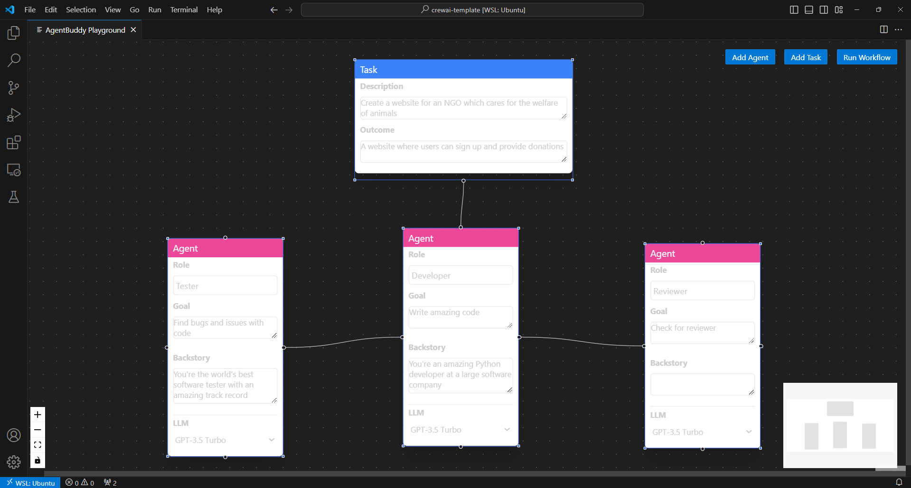

# AgentBuddy

Your friendly neighbourhood agentic workflow builder!

## Motivation

LLM based Agentic Workflows are touted to be the highlight of the year; they could totally disrupt the industry! However, to make it easy for people to onboard into the topic, we need to offer them easy tools to experiment and feel the "wow" factor for themselves. This project aims to help people build what agentic workflows are in a simple way.

## What it does

It's a visual GUI where users can build agentic workflows using simple drag and drop of blocks (ie. block based builder). They can create graphs with multiple agents talking to each other, or working in isolation, define personas for agents and assign tasks. Created agentic workflows are then exported into code, which can be executed. The app is packaged as VS Code extension, making it easy for developers to consume. The overall idea is to take a low-code/no-code approach to agentic workflow building.



## How it works

React + Vite + React Flow with Typescript for the GUI, and packaged it as a VS Code extension.
The graph that you build with the editor gets complied into a [crewAI project](https://github.com/joaomdmoura/crewAI).

The extension then executes the compiled crewAI application locally in a terminal and shows the result.

## Getting Started

### Setup

```bash
# Clone the repo
git clone https://github.com/flashbard/agentbuddy-vscode

# Navigate into project
cd agentbuddy-vscode

# Install dependencies for both the extension and webview UI source code
npm run install:all

# Build webview UI source code
npm run build:webview

# Open the project in VS Code
code .
```

### Execution

```bash
# Run the extension
npm run watch

# Run the webview project alone
npm run start:webview

```

In VS Code, open the command pallete (F1 or ctrl + shift + p), run the command `AgentBuddy: Playground`.

### Packaging the VS Code Extension

```bash
# Setup vsce locally
npm install -g @vscode/vsce

# Package the extension
vsce package

# (Optional) Install the generated VSIX file
code --install-extension <GENERATED-VSIX-FILE>
```

Made with ❤️ by Sampath at [hackOMSCS 2024](https://devpost.com/software/agentbuddy)
