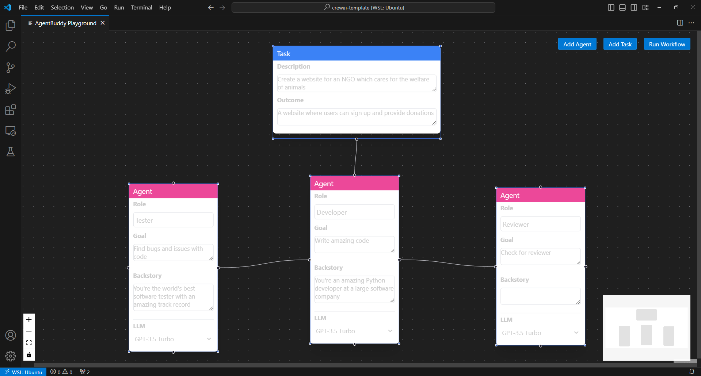

# AgentBuddy

> A visual, drag-and-drop agentic workflow builder — packaged as a VS Code extension.



Build multi-agent AI workflows without writing boilerplate. Connect agents, define their personas and tasks visually, then export and run the generated [crewAI](https://github.com/joaomdmoura/crewAI) project directly from VS Code.

Built at [hackOMSCS 2024](https://devpost.com/software/agentbuddy) 🏆

---

## Features

- 🧩 **Block-based builder** — drag, drop, and connect agent nodes on a visual canvas
- 🤖 **Multi-agent graphs** — configure agents to work in parallel, in sequence, or hierarchically
- 📝 **Persona & task editor** — define each agent's role, goal, and backstory inline
- ⚡ **One-click export** — compiles the graph to a runnable crewAI Python project
- 🖥️ **Runs in VS Code** — no external app needed; executes in an integrated terminal

## Tech Stack

- **UI**: React + Vite + [React Flow](https://reactflow.dev/) (TypeScript)
- **Extension host**: VS Code Extension API
- **Output**: [crewAI](https://github.com/joaomdmoura/crewAI) Python project

## Getting Started

### Prerequisites

- Node.js
- VS Code
- Python + crewAI (`pip install crewai`)

### Setup

```bash
git clone https://github.com/flashbard/agentbuddy-vscode
cd agentbuddy-vscode

# Install dependencies for both the extension and webview UI
npm run install:all

# Build the webview UI
npm run build:webview

# Open in VS Code
code .
```

### Run

```bash
npm run watch
```

In VS Code, open the Command Palette (`Ctrl+Shift+P`) and run:

```
AgentBuddy: Playground
```

### Package as VSIX

```bash
npm install -g @vscode/vsce
vsce package
code --install-extension agentbuddy-vscode-*.vsix
```

## License

MIT
